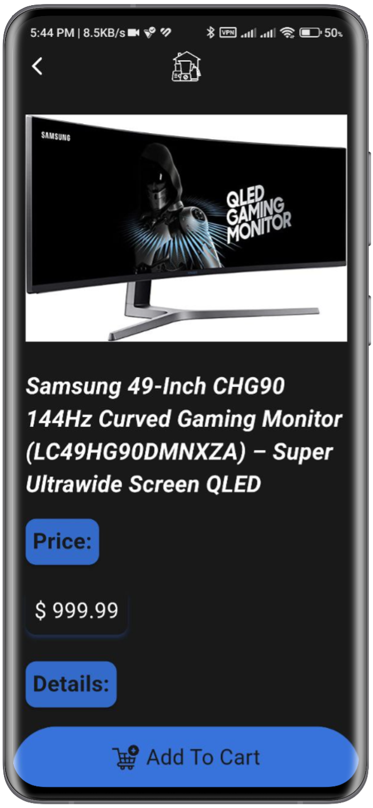

# store

News App developed with Flutter and API from DummyJson

## Features
- Animation 
- Products for all categories
- Adding products to the cart
- Ability to search for a specific product
- Support for Shimmer effect instead of ProgressIndicator

## Screenshots

### Store App LogIn page

    

### Store App Interface

    
    

### Cart Screen

    
    

### Categories Navigator

    

    

### profile  

    

### Black Theme 

    
    
    

## Technology

1. Blok 
State management library that simplifies project state control and enhances readability.
2. http 
This package contains a set of high-level functions and classes that make it easy to consume HTTP resources.
3. MVVM Architecture 
Model-View-ViewModel (MVVM) is a software design pattern that is structured to separate program logic and user interface controls.
2. Hive 
Lightweight and fast database solution for Flutter applications, providing local storage capabilities.
5. card_swiper 
Swiper/Carousel for flutter, with multiple layouts, infinite loop.
6. Animation 
Add some animation in the app for better experience.
7. Black Theme